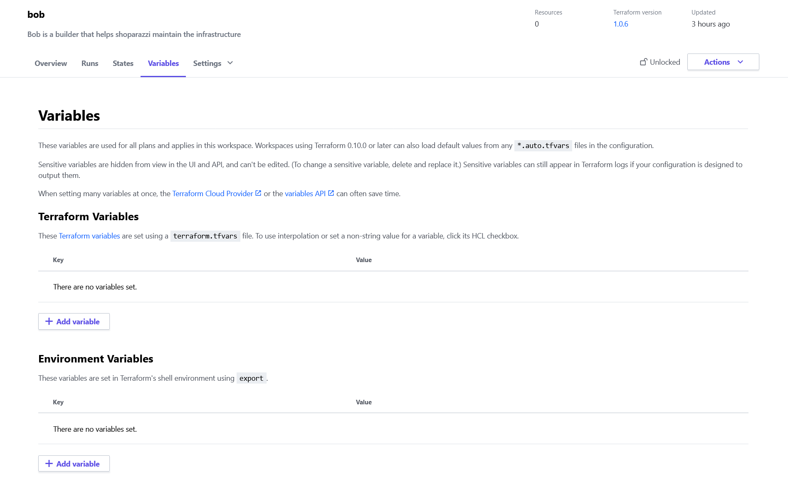

# Bob - the builder

Bob maintains the infrastructure using Terraform.


This repo was created for a dummy project called Shoparazzi. So, when you fork this for your project, make sure to search for `shoparazzi` & `bob` globally in the repo and edit accordingly.


We used a [blueprint provided by GCP](https://github.com/GoogleCloudPlatform/pci-gke-blueprint) to integrate Terraform with GCP and Google Kubernetes Engine. We changed somethings from the reference repository to make things easier. e.g, we changed the `backend.tf` to use Terraform Cloud instead GCS

We also extended it to support multiple environments for staging and production.

We used github actions to setup automation so that you never have to leave github and this repo to do any changes to your infrastructure.


## Automation

Automation is implemented using github-actions. refer `./.github/workflows/terraform.tml`.

This workflow essentially does 2 things:

* Every PR to master will create a new Terraform plan and displays all the changes that will be applied to your infrastructure upon merging this PR in a comment.

* Every merge to master triggers a github action to apply these changes to your infrastructure using terraform.


So, if you wish to do any changes to your existing infra,

1. Create a new branch from master and modify the code accordingly in the new branch
2. Raise a PR to master and review your changes in the comments
3. If everything looks good on the PR, merge it to master.


## Initial setup by admin or dev-ops

1. Create a project on Terraform cloud.

2. For github-actions to be able to access terraform add the access_key obtained on TF as `TF_API_TOKEN` in github secrets. Refer [this link](https://learn.hashicorp.com/tutorials/terraform/github-actions#set-up-terraform-cloud)

3. Run `./scripts/setup_local_env.sh` to set up the `workstation.env` file.

4. Install gcloud cli.

5. Login to gcloud cli using `gcloud auth login` and Choose the organisation email account.

6. Get `GCP_org_id` & `GCP_billing_account` required for workstation.env using 
    ```
        gcloud organizations list
        gcloud beta billing accounts list
    ```

7. Create a folder on GCP following [these steps](https://cloud.google.com/resource-manager/docs/creating-managing-folders) and update `GCP_folder_id` in `workstation.env`

8. Add a project name to `GCP_tf_admin_project` on `workstation.env` and run the following commands to create the project on GCP for terform to manage.

```
# Update the env
source workstation.env

# Create the Admin project
./scripts/setup_tf_admin_project.sh
```

9. Give a name to the terraforms' service-account you want to create on GCP by changing `GCP_tf_service_account_name` on `workstation.env` and run the following commands to create the service account.
```
# Update the env
source workstation.env

# Create the Service account
./scripts/setup_service_account.sh
```

10. Above step will create a `access_key.json` file for the service account. Move this to a location ignored by your repo and set `GCP_tf_service_account_credentials` on `workstation.env` to this new path.

11. For terraform to be able to access GCP add the access key obtained in step 9 as `GOOGLE_CREDENTIALS` in environmental variables for your project on Terraform cloud.


After successfully setting up the projects and service accounts, you can delete `GCP_tf_admin_project`, `GCP_tf_service_account_name` and `GCP_tf_service_account_credentials` from your `workstation.env` as the service will now be used by github-actions


## Setting up variables on Terraform cloud

All variables are defined in `./variables.tf`. Descriptions for the variables are available in the code. You can set values to these variables on Terraform cloud, The interface would look like below





## Documentation

You can find documentation in comments in all `.tf` files. All these files start with a brief description of all the resources it's managing. All the TF resources have inline-comments explaining every detail needed about the resource.


Example env variables are maintained in `workstation.env.example`. all the documentation is commented in the same file.


## File structure

`backend.tf` contains config for remote backend. It is set to use terraform cloud. You have to change the organisation and workspace values according to your.

`projects.tf` maintain all sub-projects created under `GCP_tf_admin_project`. This is mostly inspired by the [GKE blueprint](https://github.com/GoogleCloudPlatform/pci-gke-blueprint) .

`iam.tf` sets up Google Groups to work with k8s Role Based Access Control in your Google Kubernetes Engine.

`providers.tf` contains the cloud service providers. Currently, we use `google` and `google-beta` as we support only GCP.

`org-policies.tf` contains policies that tie access to gcp project to just our gsuite and makes sure we use secure images for containers.

`clusters.tf` Manages kubernetes clusters on GKE for staging and production.

`postgres.tf` manages postgres instances in staging and production.

`variables.tf` contains all the variables that needs to be set on terraform cloud. These will be injested by other TF resources. You can set the resource usage by GCP clusters, postgres DB in this file

`locals.tf` all the local variables that the terraform resources can use.

`vpc-service-controls.tf` and `network.tf` manage the networks in and around the k8s clusters

`dns.tf` manages the DNS for all your APIs and Frontend applications.